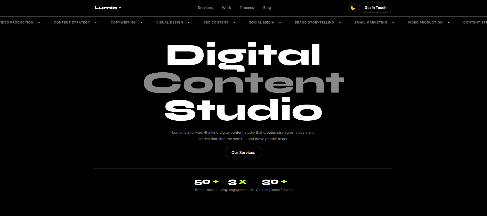

# 🌐 Lumio Studio — Landing Page (Educational Project)

This repository contains a landing page for a fictional digital content agency called **Lumio Studio**, built from scratch for educational purposes and portfolio demonstration.
Built with HTML, CSS and vanilla JavaScript, the page simulates a real-world creative agency website with animated carousels, a services section, portfolio work, client testimonials, and a contact section.

🔗 **Live demo:** https://sofiadev23.github.io/lumio-studio/

## ⚖️ Intellectual Property & Copyright Notice
* **Code**: 100% written by me from scratch. No source code was stolen or copied.
* **Images**: Stock photos sourced from [Unsplash](https://unsplash.com) under their free-to-use license.
* **Intent**: This is a non-commercial, educational project built as part of my frontend learning journey.


## 🖼️ Preview

> Dark/light themed, single-page layout with smooth animations and a clean editorial aesthetic.



## ✨ Features

- **Dark / Light mode** — theme toggle with `localStorage` persistence and no flash on load
- **CSS variable system** for themes, allowing for easy color switching between light and dark modes.
- **Mobile drawer menu** — slide-in navigation for small screens
- **Auto-scrolling services ticker** — infinite seamless loop using CSS `@keyframes` and `translateX`
- **Services section** — accordion-style rows with images and pill-style tags
- **Portfolio grid** — 2×2 project cards with hover zoom effect
- **Testimonials carousel** — animated horizontal marquee that pauses on hover
- **Blog section** — 3-column card grid with `aspect-ratio` responsive images
- **Smooth scroll navigation** — anchor links with CSS `scroll-behavior: smooth`
- **Responsive layout** — adapts to mobile, tablet and desktop via media queries
- **Google Fonts** — Inter (body) and Syne (headings)


## 🚀 Tech Stack

- **HTML5** — semantic markup
- **CSS3** — custom properties, flexbox, `clamp()`, `aspect-ratio`, `@keyframes`
- **Vanilla JavaScript** — theme toggle, mobile menu, `localStorage`


## 📁 Project Structure

```
lumio-studio/
├── src/
│   ├── index.html
│   ├── assets/
│   │   └── images/
│   │       ├── post-video.jpg
│   │       ├── post-linkedin.jpg
│   │       ├── post-content-strategy.jpg
│   │       ├── zola-skincare.jpg
│   │       ├── stackr-saas.jpg
│   │       ├── nordia-app.jpg
│   │       ├── mellow-coffee.jpg
│   │       ├── content-strategy.jpg
│   │       ├── copy-and-seo.jpg
│   │       ├── video-production.jpg
│   │       └── visual-design.jpg
│   ├── css/
│   │   ├── main.css
│   │   └── _variables.css
│   └── js/
│       └── main.js       
├── LICENSE
├── README.md
└── preview.png  
```

## 🎨 Customization

### Colors and Theme

Colors and theme variables can be customized in the file `src/css/_variables.css`.


## 🧠 What I Practiced

- CSS custom properties (variables) for theming with `data-theme` attribute
- Dark/light mode toggle with `localStorage` persistence
- Infinite carousel using the "double group" technique with CSS `@keyframes`
- `aspect-ratio` for responsive images that scale without distortion
- CSS `clamp()` for fluid typography that adapts between breakpoints
- Mobile-first responsive layout with flexbox and media queries
- Semantic HTML structure (`header`, `main`, `section`, `footer`)
- Vanilla JS DOM manipulation — classList, getAttribute, setAttribute
- Mobile drawer menu with open/close toggle


## 📚 What I Learned

This project helped me understand how to build a complete, polished landing page using only HTML, CSS and vanilla JavaScript — no frameworks, no libraries.

The most challenging parts were building a seamless infinite carousel using the double-group technique, implementing a dark/light mode system with CSS custom properties and `data-theme`, and making every section fully responsive across mobile, tablet and desktop without breaking the layout.

## 🛠️ Getting Started

No build tools or dependencies required — just download and open in a browser.
 
**Option 1 — Download ZIP (no Git required)**
 
1. Click the green **Code** button at the top of this page
2. Select **Download ZIP** and extract the folder
3. Open the folder in **VS Code**
4. Right-click the index.html file and select "Open with Live Server".
> If you don't have Live Server, you can simply double-click `index.html` to open it directly in your browser.
 
**Option 2 — Clone with Git**
 
```bash
git clone https://github.com/sofiadev23/lumio-studio.git   
cd lumio-studio
```
 
Then open the folder in VS Code and right-click the index.html file and select "Open with Live Server", or double-click `index.html` in your file explorer.

## 👤 Author

**Sofia Vieira**

Built as part of my frontend learning journey.


## License
 
This project is licensed under the MIT License — see the [LICENSE](./LICENSE) file for details.
